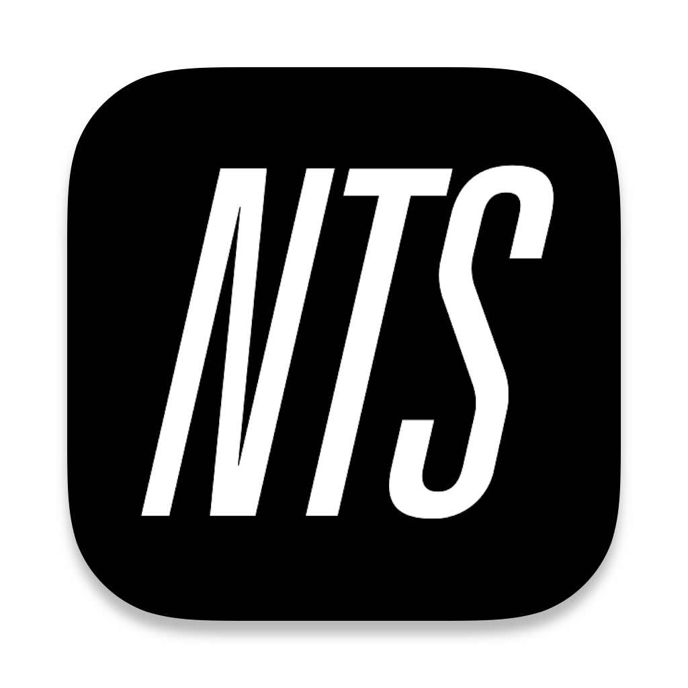

# NTS Desktop

[](https://github.com/romeovs/nts-desktop/actions/workflows/ci.yml)

An unofficial desktop app for NTS built in Electron.

## Usage

- Click the NTS logo in the menubar to open the player.
- Use the left and right buttons on the player to navigate between channels. You
	can also use the arrow keys.
- Click the play/stop button on the live streams to play them. Spacebar works
	too.
- On the live streams click the tracklist button in to top right corner to open
	the live tracklist in the browser. (This will only work if you are an [NTS
	Supporter](https://www.nts.live/supporters)).
- Drop the link from the browser to an archive show on the menubar icon to play
	it, `.webloc` files work too.
- On the archive screen, you can scroll down to reveal the controls and
	tracklist.
- Click on a tracklist item to copy the information.
- Press `⌘Q` when the window is open.
- You can refresh the app with `⌘R`


## Installation

Go to the [Releases Page](https://github.com/romeovs/nts-desktop/releases) and
fetch the `.dmg` file from the latest release.

Open the disk image and drag the `NTS Desktop` app to `Applications` and open
it.

The first time you open the app, it will show an erro because the app isn't
signed. I do not have a Mac Developer license.

To open the app anyway, you can:
```
System Preferences > Security & Privacy > General > Open Anyway
```

I have only tested this app on macOS, so I can't guarantee it works on Linux or
Windows.  If people want to help me port it over, shoot me a message, PR's are welcome!

## Local Development
The project is structured as follows:
```
./
  src/
    main.ts     # The electron main file
    preload.js  # A setup file for the browser context
    client/     # The electron renderer files
      main.ts
      ...
```

To start the app in developement mode, run:
```
make dev
```
You can now start editing the renderer files, changes will automatically
take effect on save.

Note that changes to the main process (`src/main.ts` and `src/preload.js`)
require a restart to take effect.

To build the application run:
```
make build package
```
The app will now be in `bundle/mac-universal/NTS Desktop.app`.

## Acknowledgement

The main idea for the app came from the excellent
[nts-desktop-app](https://github.com/tedigc/nts-desktop-app), the implementation
of which is way simpler and more elegant, but lacks some of the features I
wanted.
